# Android Portfolio — Роман Чудов

Senior Android Developer · Москва · Удалённо / гибрид  
📧 roma-job@yandex.ru · 📱 +7 916 268 62 56

---

## Обо мне

Проектирую Android-приложения, которые работают без интернета и не теряют данные.  
Дважды вывел продукты в production как единственный Android-разработчик — самостоятельно принимал все технические решения и согласовывал API с backend.

**Специализация:** offline-first системы, где цена потери данных высока.  
**Редкое сочетание:** 11 лет проектирования БД Oracle дают методологию синхронизации данных, которой нет у большинства Android-разработчиков.

---

## Проекты

---

## Проект 1: Offline-first платформа для полевых команд

**B2B · 500+ сотрудников · Единственный Android-разработчик**

Корпоративное приложение для мерчандайзеров и их руководителей одного из крупнейших маркетинговых агентств России. Полевые сотрудники работают в зонах без интернета — приложение сохраняет все данные локально и синхронизирует при появлении связи.

**Роль:** вывел продукт в production с нуля — самостоятельно принимал архитектурные решения, согласовывал API с backend.

### Стек

`Kotlin` `Coroutines` `Flow` `Hilt` `Clean Architecture` `Room` `CameraX` `Yandex MapKit` `Firebase FCM` `Retrofit` `JUnit` `Mockk`

### Экраны

**Сплэш-экран — загрузка и синхронизация**  
Экран запуска. .

---

**Главный экран — модульная навигация**  
Плашки основных модулей.

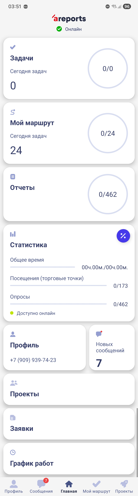

---

**Мой маршрут — список задач**  
Список задач назначенных сотруднику с поиском. Работает offline: данные хранятся локально в Room. Объём offline-данных — 200+ МБ без просадки производительности.

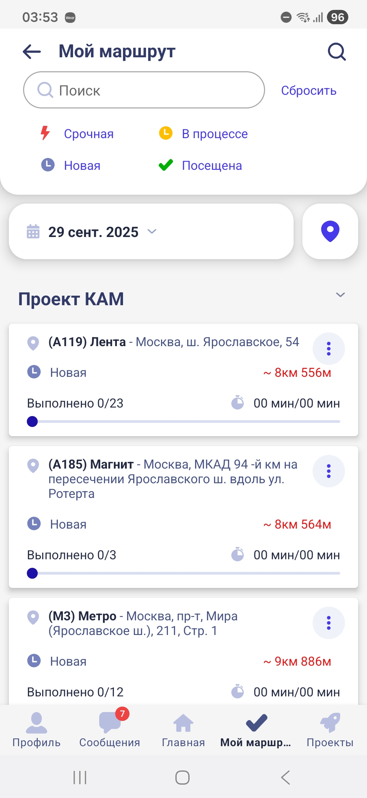

---

**Карта маршрута**  
Задачи на карте (Yandex MapKit) с детальной информацией по каждой точке. Руководитель видит статус выполнения задач сотрудников в режиме реального времени.

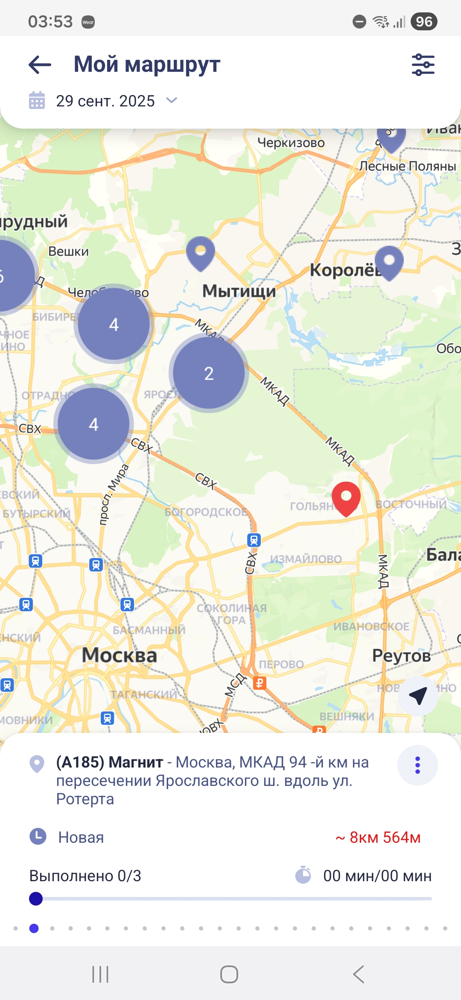

---

**Экран задачи — три вкладки**  
Список опросов-отчётов, документы по точке и контакты. Опросы могут включать модули распознавания — подключил три библиотеки (Ailet, IC, in-house).

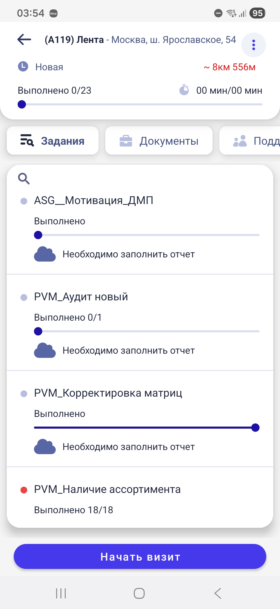

---

**Экраны опросов — 9+ типов вопросов**  
Кастомный движок опросов с динамическим ветвлением: логика следующего вопроса зависит от предыдущего ответа.

Типы вопросов:
- Логические — ветвление сценария в зависимости от ответа
- Матричные — вопросы сгруппированы по товару (фото + штрихкод)
- Выбор одного / нескольких вариантов
- Текстовое поле
- Числовое поле со счётчиком
- Фото (CameraX + галерея)
- Аудио
- Распознавание (Ailet, IC, in-house SDK)

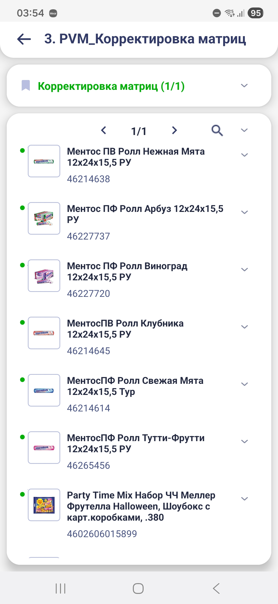 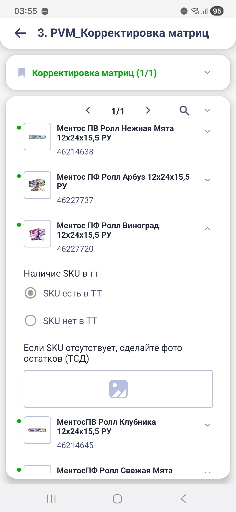 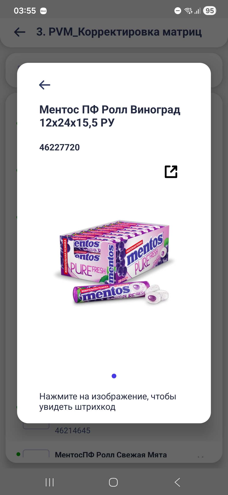 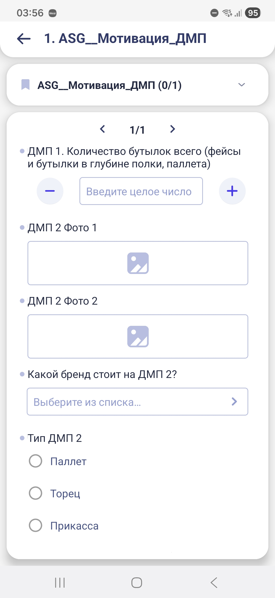

---

**Проекты**  
Список доступных пользователю проектов с детальной информацией: описание, документы, команда.

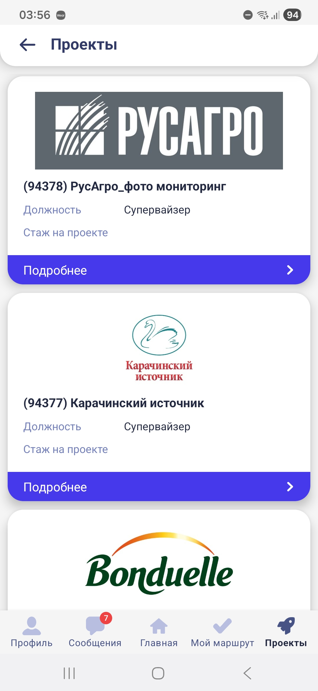 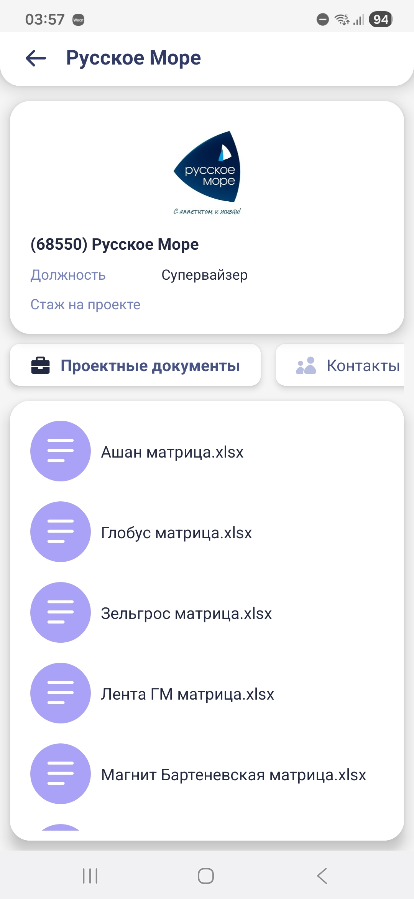

---

**Заявки — кадровый учёт**  
Модуль HR-процессов: заявки с отслеживанием статуса выполнения. Сократил время оформления кадровых заявок с 2 дней до 2 часов — экономия 320 человеко-часов ежемесячно.

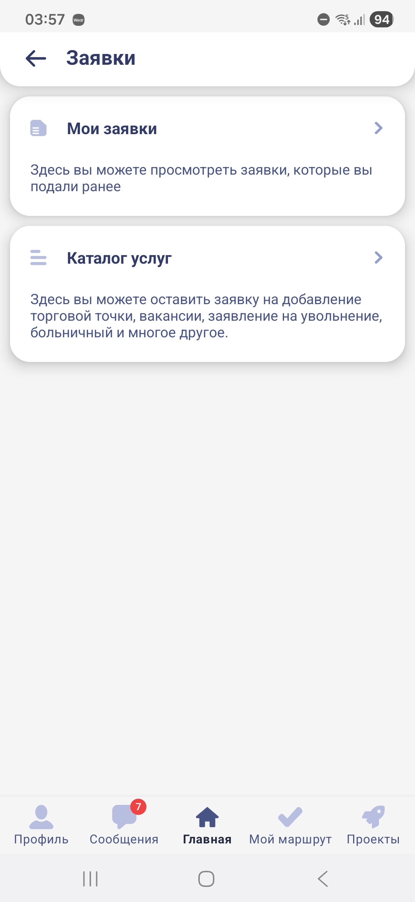 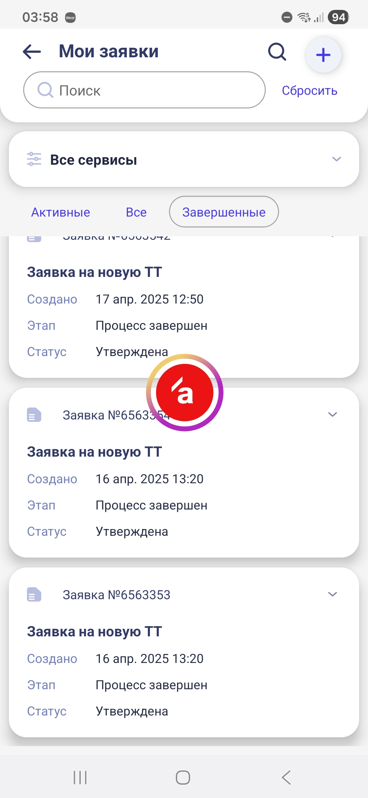

---

**График работ — контроль для руководителя**  
Руководитель проверяет выполнение задач сотрудниками: список и карта с отображением по точкам.

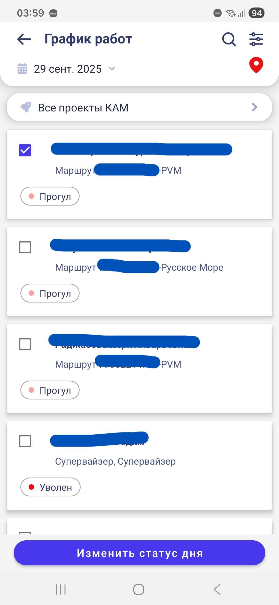 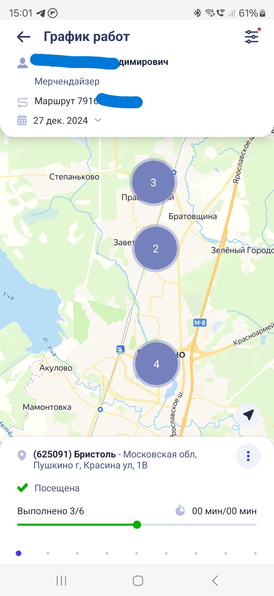

---

**Сообщения — центр уведомлений**  
Входящие уведомления для сотрудника: новые задачи, результаты проверки опросов руководителем, внемаршрутные задачи. Push через Firebase FCM.

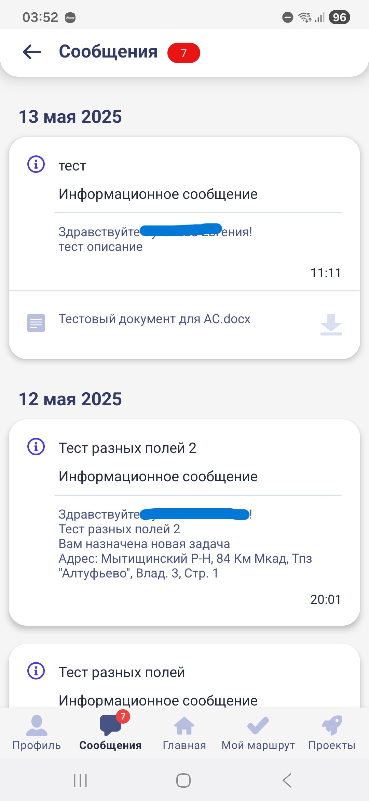

---

**Профиль**  
Личные данные пользователя с редактированием и настройками приложения.

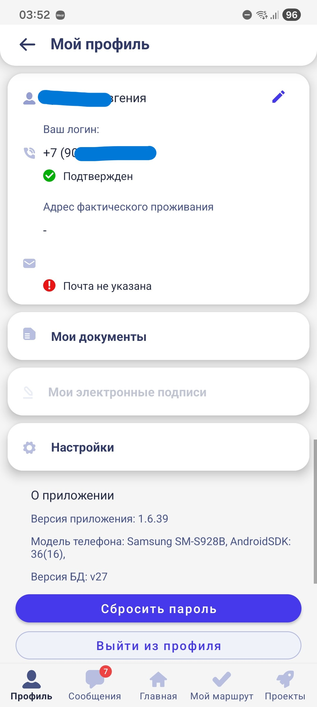

---

### Ключевые технические решения

- Спроектировал схему БД Room с версионированием записей и стратегию разрешения конфликтов синхронизации совместно с backend (11 лет опыта Oracle)
- Реализовал движок динамических опросов с ветвлением — логика следующего вопроса зависит от предыдущего ответа
- Подключение 3 библиотек распознавания (Ailet, IC, in-house)
- Покрыл стратегию синхронизации unit-тестами (JUnit, Mockk) как основной риск системы

### Результат

| Метрика | До | После |
|---|---|---|
| Время оформления кадровых заявок | 2 дня | 2 часа |
| Экономия для заказчика | — | 320 чел/часов в месяц |

---

## Проект 2: Маркетплейс подработок для самозанятых

**B2C · 10 000+ пользователей · Единственный Android-разработчик**

Приложение для поиска и выполнения подработок. Пользователь находит задачи рядом, берёт в работу и получает оплату — всё в одном приложении.

**Роль:** вывел продукт в production с нуля, затем провёл полный редизайн и переработку архитектуры.

### Стек

`Kotlin` `Coroutines` `Flow` `Hilt` `Clean Architecture` `MVVM` `Room` `Yandex MapKit` `Retrofit` `Firebase FCM` `T-Bank ID SDK`

### Экраны

**Сплэш-экран — загрузка приложения**  
Экран запуска с инициализацией сессии и проверкой авторизации.

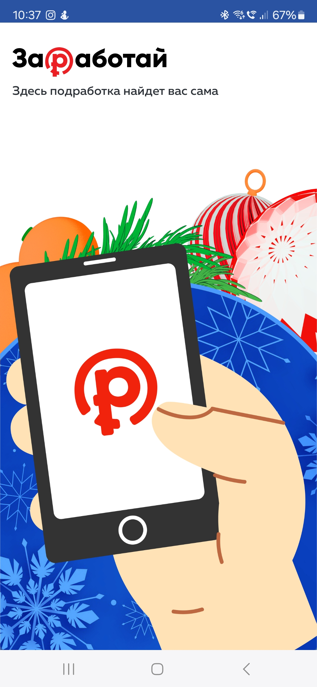

---

**Регистрация — четыре шага**  
Ввод номера телефона → подтверждение кода из SMS → выбор региона → выбор навыков. Минимальный путь до начала работы.

---

**Подработки — три режима просмотра**  
Доступные задачи с поиском по местоположению, отображением на карте (Yandex MapKit) и по календарю.

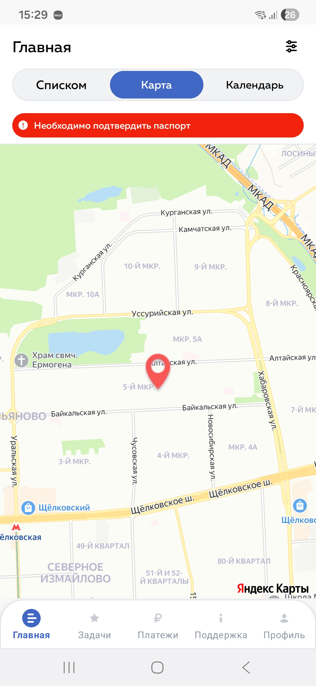 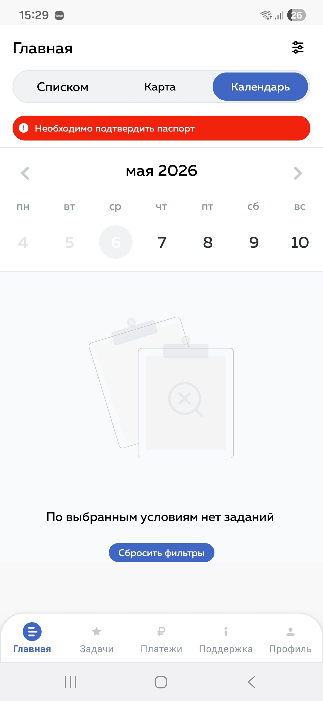

---

**Детальная информация по задаче**  
Полное описание подработки с возможностью взять её в работу.

---

**Выполнение задачи**  
Активная подработка: список заданий с отметкой выполнения. Сотрудник ведёт задачу от старта до завершения.

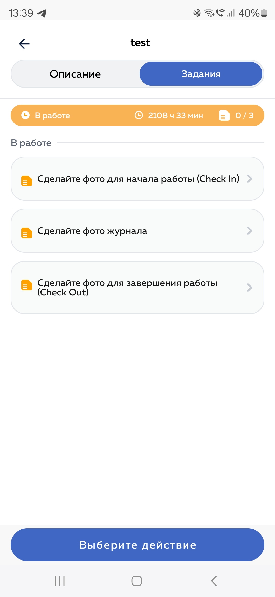

---

**Выбор метода оплаты**  
Три способа выплат на стороне приложения: СБП с выбором банка, T-Bank ID (SDK), ручной ввод реквизитов — самозанятые с любым банком оформляют получение оплаты в приложении.

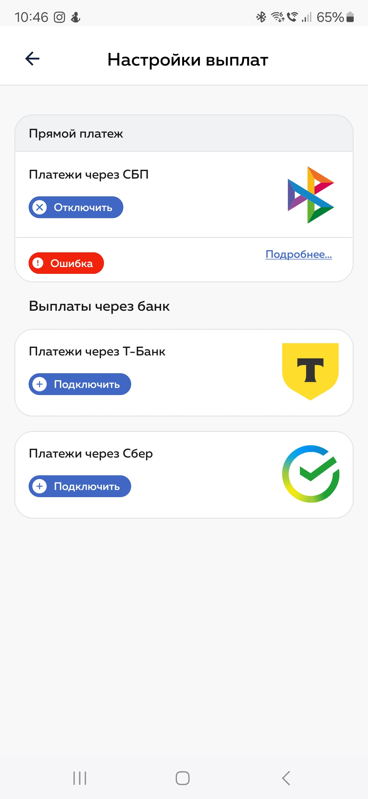

---

**Платежи — история выплат**  
Список оплат с детальной информацией и статусом каждого платежа.

---

**Профиль**  
Личные данные с редактированием, центр уведомлений и настройки. Push через Firebase FCM.

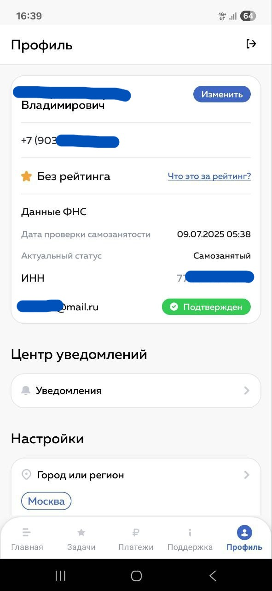

---

**Документы — верификация самозанятого**  
Для начала работы: фото паспорта и селфи. Также возможна загрузка дополнительных документов.

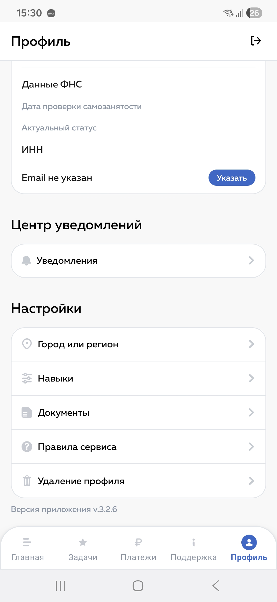

---

### Ключевые технические решения

- Полный редизайн и переработка архитектуры: перешёл на Clean Architecture и MVVM
- Интегрировал T-Bank ID SDK — авторизация без ручного ввода данных
- Реализовал три способа выплат (СБП, T-Bank ID, реквизиты) — покрыл аудиторию с любым банком

### Результат

| Метрика | Результат |
|---|---|
| Новые пользователи после редизайна | +40% |
| Количество выполненных заданий | +70% |
| Пользователей в production | 10 000+ |

---

*Senior Android Developer · roma-job@yandex.ru · +7 916 268 62 56*
